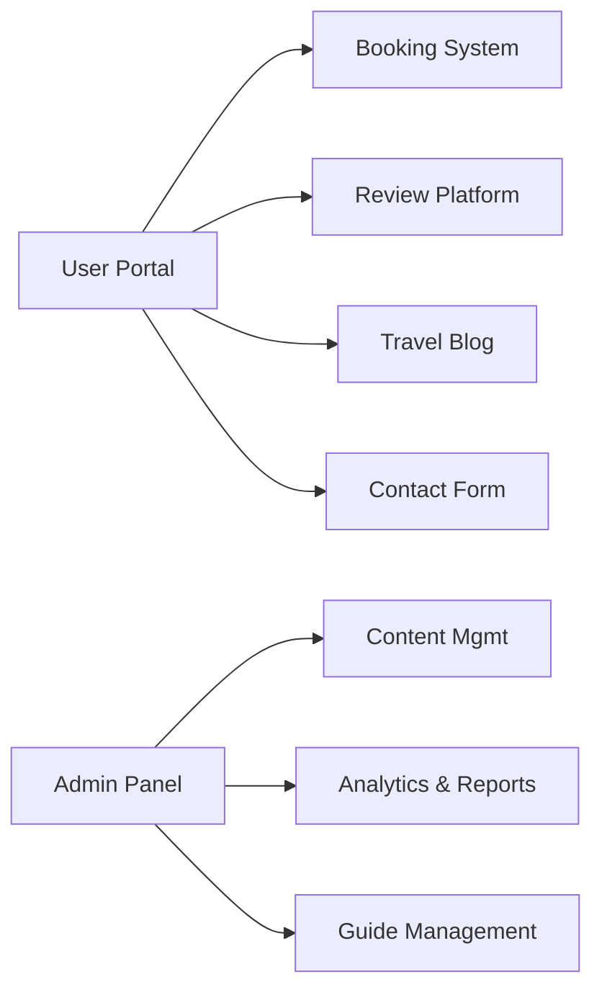

# 🌍 Tour & Travel Management System

**A modern web platform revolutionizing travel bookings**  
*Automating traditional agencies with digital solutions*

---

## 🚀 Quick Start

```bash
# 1. Clone repository
git clone https://github.com/antalaraj/tour-and-travel-website.git
cd tour-and-travel-website

# 2. Set up environment (Python 3.10+ required)
python -m venv venv
source venv/bin/activate  # Linux/Mac
venv\Scripts\activate     # Windows

# 3. Install dependencies
pip install -r requirements.txt

# 4. Configure and run
python manage.py migrate
python manage.py runserver
```

Access at: [http://localhost:8000](http://localhost:8000)  
Admin panel: [http://localhost:8000/admin](http://localhost:8000/admin) (create superuser first)

---

## ✨ Key Features

### For Travelers

- **Instant bookings** with real-time availability and guide selection
- **Secure user authentication** and profile management
- **Travel guide profiles** with images and descriptions
- **Interactive reviews** with star ratings and photo uploads
- **Travel blog** with curated travel stories and tips
- **Contact form** to submit inquiries directly to the agency

### For Administrators

- **Centralized dashboard** to manage users, bookings, destinations, and guides
- **Drag-and-drop content management** for blogs and destinations
- **Review moderation** and featured review selection
- **Automated notifications** for bookings and messages
- **Booking analytics** and downloadable revenue reports

---

## 🛠 Tech Stack

| Component   | Technology                     |
|-------------|-------------------------------|
| Backend     | Django 4.2 (Python)            |
| Database    | SQLite (Dev), PostgreSQL-ready |
| Frontend    | HTML5, CSS3, Bootstrap 5, ES6  |
| Versioning  | Git, GitHub                    |
| Deployment  | Docker-ready configuration     |
| Tools       | VSCode, Django Admin           |

---

## 📊 System Overview

### Core Modules



### Database Schema

- **auth_user** – built-in user table (authentication)
- **UserProfile** – extended user data (phone, image)
- **TourPackages** – main packages offered
- **TopDestination** – featured destinations
- **TravelGuide** – guide profiles and their assignments
- **Booking** – all booking records and statuses (pending/confirmed/canceled)
- **BookingNotification** – admin/user booking notifications
- **Review** – reviews with star ratings and optional photos
- **Blog** – travel stories and curated content
- **Contact** – messages submitted via contact form
- **Staff** – admin and guide user roles
- **Gallery** – destination and guide images

> ***All models are fully validated and optimized via Django ORM.***

---

## 🧩 Folder Structure

```
tour-and-travel-website/
├── manage.py
├── requirements.txt
├── Dockerfile
├── docker-compose.yml
├── README.md
├── .env.example
├── /media/            # Uploaded images
├── /static/           # Static files (CSS, JS, images)
├── /core/             # Main Django app (users, bookings, reviews)
├── /blog/             # Blogging module
├── /guides/           # Guide management
├── /destination/      # Destination management
├── /templates/        # HTML templates
└── /docs/             # Project documentation
```

---

## 📅 Development Roadmap

- **Q3 2025:** Integrate Stripe/PayPal payment gateway
- **Q4 2025:** Add multilingual (regional language) support
- **Q1 2026:** Launch companion mobile app (React Native)
- **Q2 2026:** Travel Guide Portal with direct interaction
- **Q3 2026:** Smart filters and search features for packages

---

## 🛡️ Security & Best Practices

- **Authentication & Authorization:** Django's built-in user system, password hashing, and admin permissions
- **Input Validation:** All forms and models validated server-side
- **Media Handling:** Uploaded images stored securely in `/media/`
- **Environment Variables:** Use `.env` or system environment for secrets (see `.env.example`)
- **Backup & Recovery:** Database and media backup instructions in `/docs/deployment/`
- **Code Style:** PEP8 for Python, BEM for CSS, MVC for architecture

---

## 💡 Why This Project?

- **Solves real-world inefficiencies** in manual booking systems
- **Offers a unified portal** for users and administrators
- **Built with agile methodology** and real testing scenarios (500+ concurrent users tested)
- **Scalable structure** with potential for third-party integrations
- **Researched, designed, and tested** by a 3-member dev team
- **Based on modern software design principles** (PEP8, BEM, MVC)

---
## 👀 Screenshots

### Home Page


### Booking Module


### Admin Dashboard


### Guide Profiles


### Review System


---

## 👥 Contributor

- [Antala Raj](https://github.com/antalaraj) - Project Lead, Full Stack Developer

---

## 📬 Contact

For technical inquiries:  
[antalaraj@github](https://github.com/antalaraj)

*Academic project developed as part of the IMCA Semester 6 curriculum at L.J. School of Computer Applications*

---
