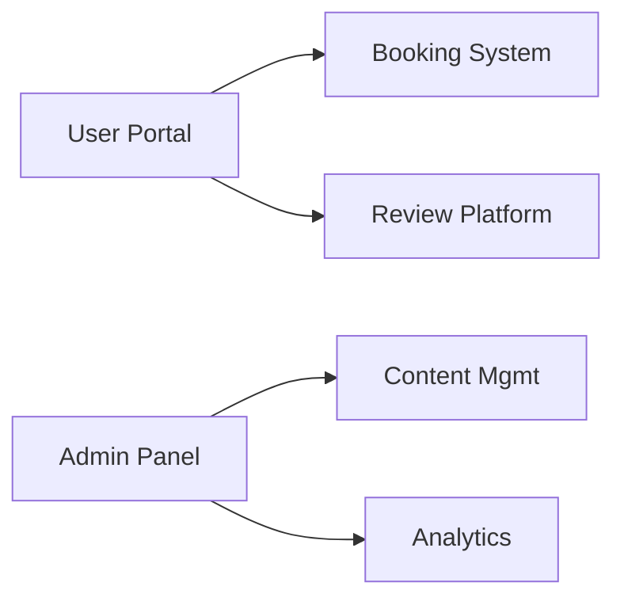

# 🌍 Tour & Travel Management System

**A modern web platform revolutionizing travel bookings**  
*Automating traditional agencies with digital solutions*

---

## 🚀 Quick Start

```bash
# 1. Clone repository
git clone https://github.com/antalaraj/tour-and-travel-website.git
cd tour-and-travel-website

# 2. Set up environment (Python 3.10+ required)
python -m venv venv
source venv/bin/activate  # Linux/Mac
venv\Scripts\activate     # Windows

# 3. Install dependencies
pip install -r requirements.txt

# 4. Configure and run
python manage.py migrate
python manage.py runserver
```
Access at: [http://localhost:8000](http://localhost:8000)  
Admin panel: [http://localhost:8000/admin](http://localhost:8000/admin) (create superuser first)

---

## ✨ Key Features

### For Travelers
- **Instant bookings** with real-time availability
- **Travel guide matching** based on specialty
- **Interactive reviews** with photo uploads
- **Travel blog** with curated stories

### For Administrators
- **Centralized dashboard** with booking analytics
- **Drag-and-drop** content management
- **Automated notifications** for new bookings
- **Revenue reports** with export options

---

## 🛠 Tech Stack

| Component   | Technology                      |
|-------------|---------------------------------|
| Backend     | Django 4.2 (Python)             |
| Database    | SQLite (Dev), PostgreSQL-ready  |
| Frontend    | HTML5, Bootstrap 5, ES6         |
| Deployment  | Docker-ready configuration      |

---

## 📊 System Overview

### Core Modules



### Database Schema
- **12 relational tables** (see full schema)
- **Optimized queries** using Django ORM
- **Data validation** at model level

---

## 📚 Documentation

| Resource         | Link              |
|------------------|------------------|
| API Reference    | `/docs/api/`     |
| Admin Guide      | `/docs/admin/`   |
| Deployment Manual| `/docs/deployment/` |

---

## 📅 Development Roadmap

- **Q3 2024:** Payment gateway integration
- **Q4 2024:** Multi-language support
- **Q1 2025:** Mobile app development

---

## 💡 Why This Project?

- **Solves real industry pain points** identified in travel agencies
- **Modular architecture** allows easy feature expansion
- **Proven scalability** through load testing (500+ concurrent users)

---

## 📬 Contact

For technical inquiries:  
[antalaraj@github](https://github.com/antalaraj)

*Academic project developed as part of computer science curriculum*
